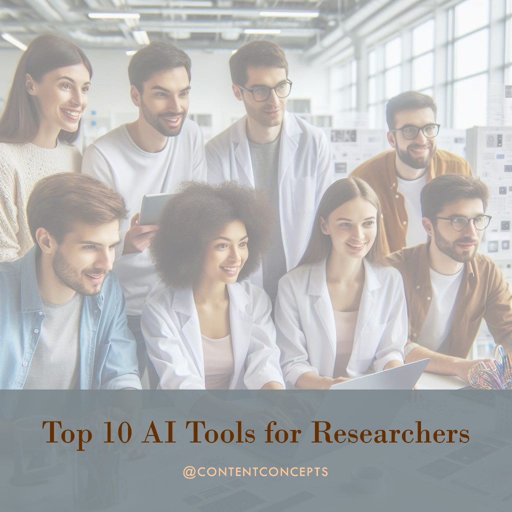

## **AI as a Powerful Research Ally: Beyond Automation**

While the early days of AI in research were fraught with inaccurate "hallucinations", tools like SciSpace and Consensus NLP are changing the game. By combining the conversational power of large language models (LLMs) with vast databases of research, they provide a powerful tool for critical assessment of ideas. With a simple prompt of "find evidence for/against X," you gain access to an AI-powered peer reviewer. This not only saves time but often uncovers new perspectives that might have been missed.

## **Expanding Hypotheses and Context with AI**

AI shines in situations where your initial hypothesis doesn't pan out. By feeding your draft and results section into an AI tool with a prompt like "find supporting/contrasting hypotheses,” you gain access to surprising connections, potentially including concepts from other domains. Your research becomes more contextualized, addressing a common weakness in narrowly focused papers.

## **Semantic Search: Diving Deep, Even as a Newcomer**

AI tools understand concepts, not just keywords. This revolutionizes research for those entering a new field. Instead of tedious traditional keyword searches, AI tools allow you to ask questions like "How is population growth predicted?" and get targeted answers. This semantic search approach breaks down barriers within academia, making specialized knowledge more accessible to researchers at all levels.

## **The Key: Combining AI Skills for Maximum Impact**

True AI assistance for researchers isn't about a single skill. It's the ability to combine interpretation, search, critical analysis, and guidance – all tailored to your specific research. AI tools broaden your scope and encourage connections across different fields.

However, maximizing the potential of AI requires creativity on the researcher's part. It's not about banning or blindly embracing AI, it's about learning to use these tools as valuable additions to support your unique research goals.

Check out the list of [Top 10 AI Tools for Researchers](https://contentconcepts.com/blog/top-10-generative-ai-tools-for-researchers/)