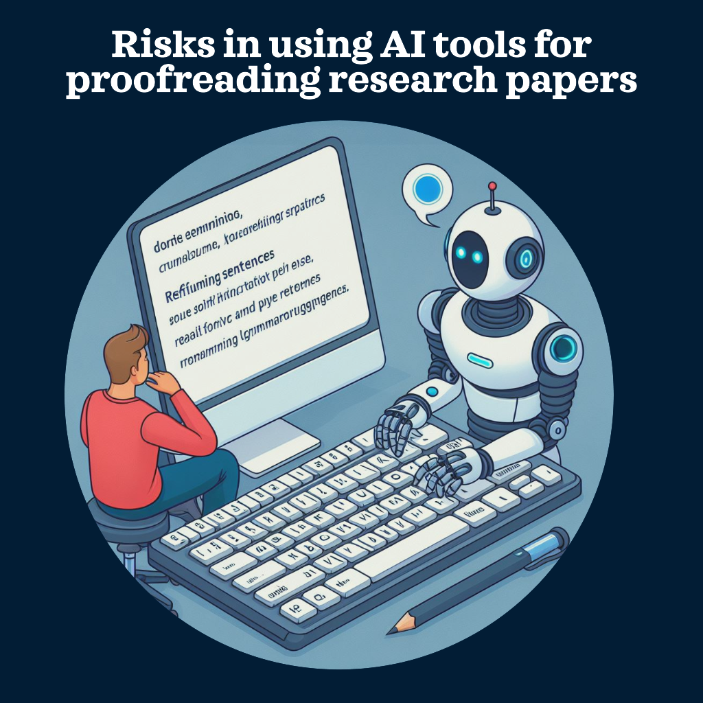

When you want to use AI tools for proofreading or editing your research papers or thesis, please be aware of these risks and challenges that these tools might pose:

* **Watch out for Copycat Issues**: Sometimes, AI might nudge you towards wording that's a bit too similar to someone else's work. You definitely don't want to be caught in the plagiarism trap!
* **Missing the Point**: Let's face it, AI isn't great at getting the gist of things all the time. It might misread your text and give you advice that’s way off base.
* **Keep It Secret, Keep It Safe**: When you upload your paper to those AI proofreading sites, you're taking a gamble with your data. Who knows who could get their hands on your hard work?
* **Don’t Get Too Comfy with Tech**: Relying solely on AI can make you a bit lazy in reviewing your work thoroughly. It's like using a calculator for everything and forgetting how to do simple math!
* **Identity Crisis**: AI might try to change your style or voice, and that's a no-no. You want your paper to sound like you, not a robot.
* **Skimming the Surface**: AI is pretty good at spotting typos and grammar hiccups, but when it comes to the meaty stuff like your research methods or the strength of your arguments? Not so much.
* **Trust Issues**: AI isn’t perfect. It might mess up, and if you're not careful, these blunders could sneak into your final draft.

Remember, while AI tools are handy, they’re no substitute for good old-fashioned human proofreading. You've got to strike a balance to make sure your paper is top-notch.