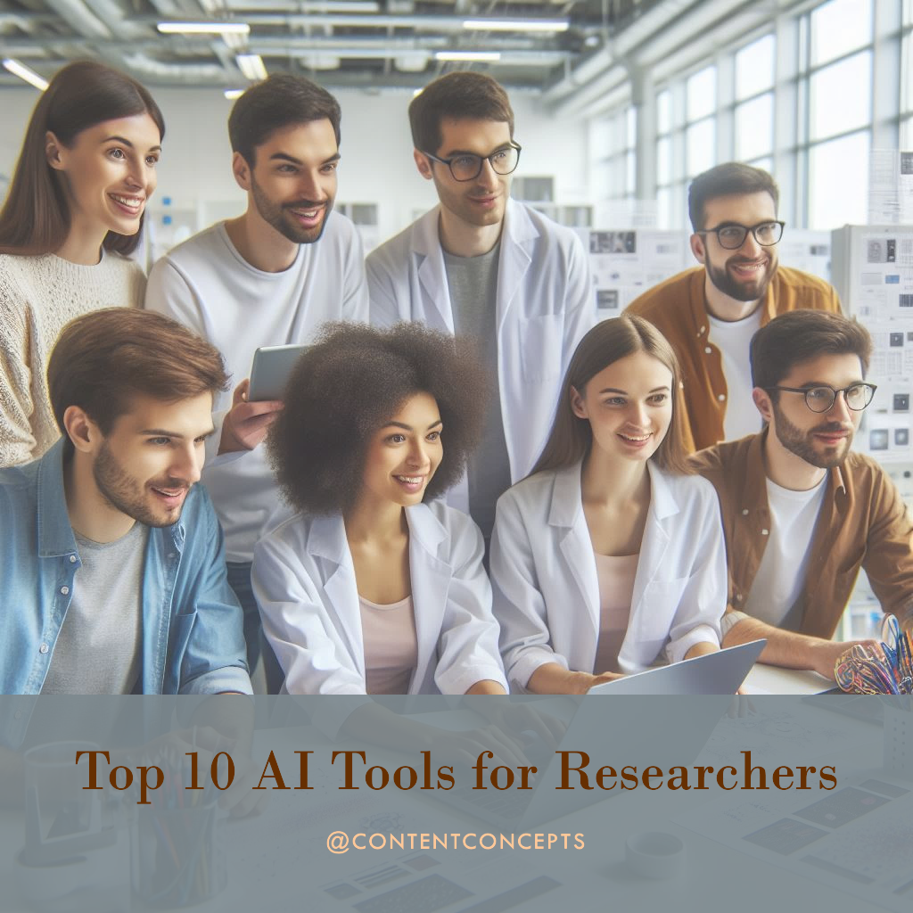

AI isn't just about efficiency in research, it's about revolutionizing how researchers think. AI tools act like tireless peer reviewers, [manuscript editors](https://contentconcepts.com/services/academic_editing/manuscript-editors/), help refine hypotheses, and connect your work to broader contexts. Transform your research from focused to impactful – unlock the power of AI-assisted critical analysis. 

As a techno optimist, [ContentConcepts](https://contentconcepts.com/) fully supports and ecnourages the use of Generative AI tools such as ChatGPt and other tools in academic research and writing.

## **AI as a Powerful Research Ally: Beyond Automation**

While the early days of AI in research were fraught with inaccurate "hallucinations", tools like SciSpace and Consensus NLP are changing the game. By combining the conversational power of large language models (LLMs) with vast databases of research, they provide a powerful tool for critical assessment of ideas. With a simple prompt of "find evidence for/against X," you gain access to an AI-powered peer reviewer. This not only saves time but often uncovers new perspectives that might have been missed.

## **Expanding Hypotheses and Context with AI**

AI shines in situations where your initial hypothesis doesn't pan out. By feeding your draft and results section into an AI tool with a prompt like "find supporting/contrasting hypotheses,” you gain access to surprising connections, potentially including concepts from other domains. Your research becomes more contextualized, addressing a common weakness in narrowly focused papers.

## **Semantic Search: Diving Deep, Even as a Newcomer**

AI tools understand concepts, not just keywords. This revolutionizes research for those entering a new field. Instead of tedious traditional keyword searches, AI tools allow you to ask questions like "How is population growth predicted?" and get targeted answers. This semantic search approach breaks down barriers within academia, making specialized knowledge more accessible to researchers at all levels.

## **The Key: Combining AI Skills for Maximum Impact**

True AI assistance for researchers isn't about a single skill. It's the ability to combine interpretation, search, critical analysis, and guidance – all tailored to your specific research. AI tools broaden your scope and encourage connections across different fields.

However, maximizing the potential of AI requires creativity on the researcher's part. It's not about banning or blindly embracing AI, it's about learning to use these tools as valuable additions to support your unique research goals.

Here is a list of top AI tools for academic researchers.

## **1. [Scite](https://scite.ai/)**

* **How it helps:** Analyzes citations to help you determine the validity and reliability of previous research. Scite lets you see if a paper has been supported or contradicted by subsequent studies.
* **Key features:** Smart citations, visualizations of citation context, ability to filter papers based on citation sentiment.

## **2. [Scholarcy](https://www.scholarcy.com/)**

* **How it helps:** Summarizes and extracts key information from research papers quickly.
* **Key Features:** AI-powered literature summarization, knowledge graph visualization, finding related papers and concepts easily.

## **[3. Research Rabbit](https://www.researchrabbit.ai/)**

* **How it helps:** Discover new research papers and organize your research process.
* **Key features:** Recommendations for similar papers, building collections of papers, adding notes and highlights.

## [**4. Elicit**](https://elicit.com/)

* **How it helps:** Find the most relevant research papers for your work from a large body of literature.
* **Key features:** Uses language models to understand your research question and pinpoint relevant studies, even if they don't use the exact same keywords.

## **[5. Consensus AI](https://consensus.app/)**

* **How it helps:** Designed to answer challenging scientific questions directly from within research papers. It doesn't just provide links, it extracts the answers.
* **Key Features:** AI-powered search tailored to scientific literature, focuses on providing clear answers within the research itself.

## **[6. Litmaps](https://www.litmaps.com/)**

* **How it helps:** Helps visualize the connections within a field of academic research.
* **Key Features:** Interactive maps that show the 'landscape' of research, revealing connections between papers that might not be obvious within traditional searches.

## **[7. SciSpace](https://typeset.io/)**

* **How it helps:** This tool is a powerhouse for reading, understanding, and even writing your own scientific papers.
* **Key Features:** Huge database of scientific publications, AI-powered summaries to get the core concepts quickly, and tools to assist your own writing process.

## **[8. Scisummary](https://scisummary.com/)**

* **How it helps:** Takes long, complex scientific papers and summarizes them quickly and accurately.
* **Key Features:** AI-driven summarization specifically trained on scientific papers, helps identify the most important findings within the research.

1. **Inciteful**

* **How it helps:** Perfect for finding and analyzing prior art, a key part of patent searches or in-depth research for new papers and projects.
* **Key Features:** Enhances standard patent search capabilities, uses AI to analyze the documents it finds for relevance and insight.

1. **Connected Papers**

* **How it helps:** Builds visual representations of relationships between academic papers. Think of it like a mind map for research!
* **Key Features:** Graph-based exploration to see how papers influence each other, finds similar works, and helps you trace the origins of ideas.