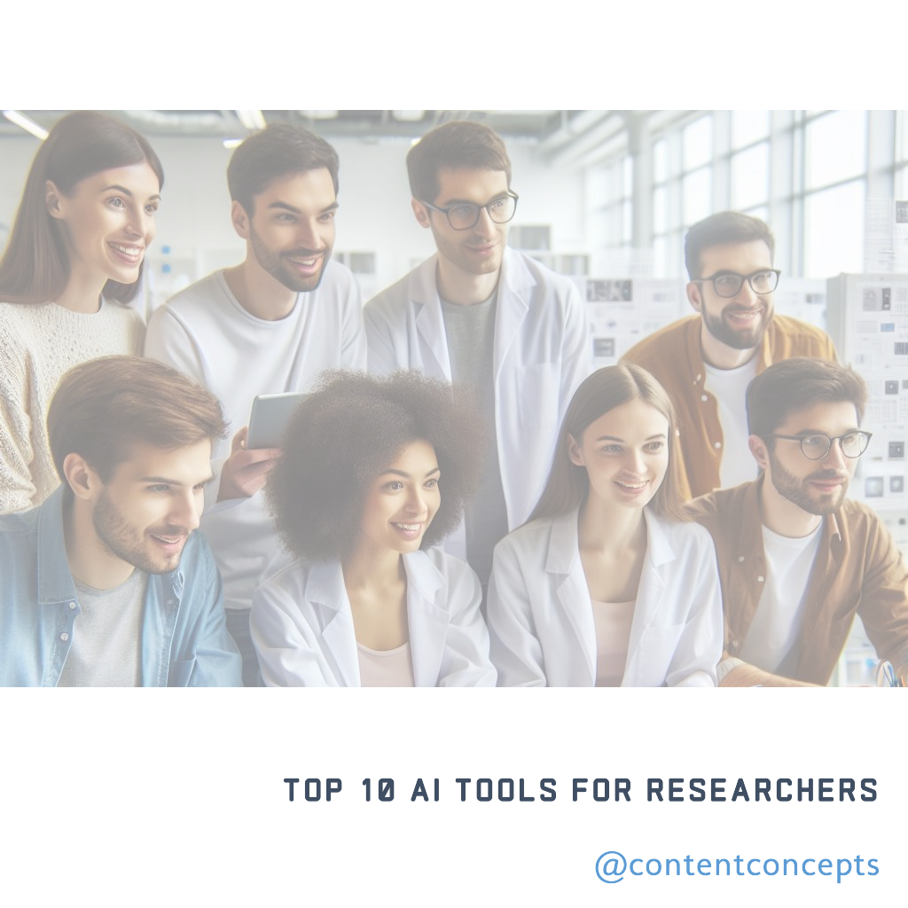

AI isn't just about efficiency in research, it's about revolutionizing how researchers think. AI tools act like tireless peer reviewers, [manuscript editors](https://contentconcepts.com/services/academic_editing/manuscript-editors/), help refine hypotheses, and connect your work to broader contexts. Transform your research from focused to impactful – unlock the power of AI-assisted critical analysis. 

Here is a list of top AI tools for academic researchers.

## **1. [Scite](https://scite.ai/)**

* **How it helps:** Analyzes citations to help you determine the validity and reliability of previous research. Scite lets you see if a paper has been supported or contradicted by subsequent studies.
* **Key features:** Smart citations, visualizations of citation context, ability to filter papers based on citation sentiment.

## **2. [Scholarcy](https://www.scholarcy.com/)**

* **How it helps:** Summarizes and extracts key information from research papers quickly.
* **Key Features:** AI-powered literature summarization, knowledge graph visualization, finding related papers and concepts easily.

## **[3. Research Rabbit](https://www.researchrabbit.ai/)**

* **How it helps:** Discover new research papers and organize your research process.
* **Key features:** Recommendations for similar papers, building collections of papers, adding notes and highlights.

## **[4. Elicit](https://elicit.com/)**

* **How it helps:** Find the most relevant research papers for your work from a large body of literature.
* **Key features:** Uses language models to understand your research question and pinpoint relevant studies, even if they don't use the exact same keywords.

## **[5. Consensus AI](https://consensus.app/)**

* **How it helps:** Designed to answer challenging scientific questions directly from within research papers. It doesn't just provide links, it extracts the answers.
* **Key Features:** AI-powered search tailored to scientific literature, focuses on providing clear answers within the research itself.

## **[6. Litmaps](https://www.litmaps.com/)**

* **How it helps:** Helps visualize the connections within a field of academic research.
* **Key Features:** Interactive maps that show the 'landscape' of research, revealing connections between papers that might not be obvious within traditional searches.

## **[7. SciSpace](https://typeset.io/)**

* **How it helps:** This tool is a powerhouse for reading, understanding, and even writing your own scientific papers.
* **Key Features:** Huge database of scientific publications, AI-powered summaries to get the core concepts quickly, and tools to assist your own writing process.

## **[8. Scisummary](https://scisummary.com/)**

* **How it helps:** Takes long, complex scientific papers and summarizes them quickly and accurately.
* **Key Features:** AI-driven summarization specifically trained on scientific papers, helps identify the most important findings within the research.

## **[9.Connected Papers](https://www.connectedpapers.com/)**

* **How it helps:** Builds visual representations of relationships between academic papers. Think of it like a mind map for research!
* **Key Features:** Graph-based exploration to see how papers influence each other, finds similar works, and helps you trace the origins of ideas.

## [10. Notebook LLM](https://notebooklm.google/)

\
**How it helps:** A versatile tool that blends the power of information gathering, organization, and writing assistance – all with an AI-powered edge. It's designed to streamline and enhance the research and writing process.

**Key Features:**

* **AI-Assisted Note-Taking:** Integrates information from various sources (docs, web, etc.), automatically generating summaries and identifying key topics.
* **Question-Answering:** Asks questions directly about your notes and sources, making fact-checking and exploration much more intuitive.
* **Drafting Assistance:** Generates text drafts, outlines, and brainstorms ideas, offering a springboard for your own writing.
* **Source Integration:** Seamlessly manages references and citations, ensuring the integrity of your work.